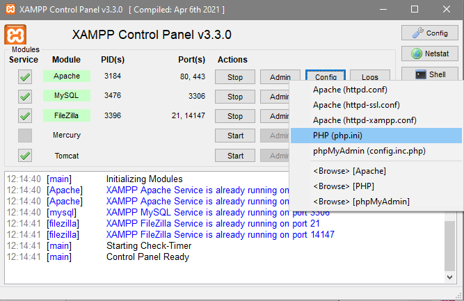
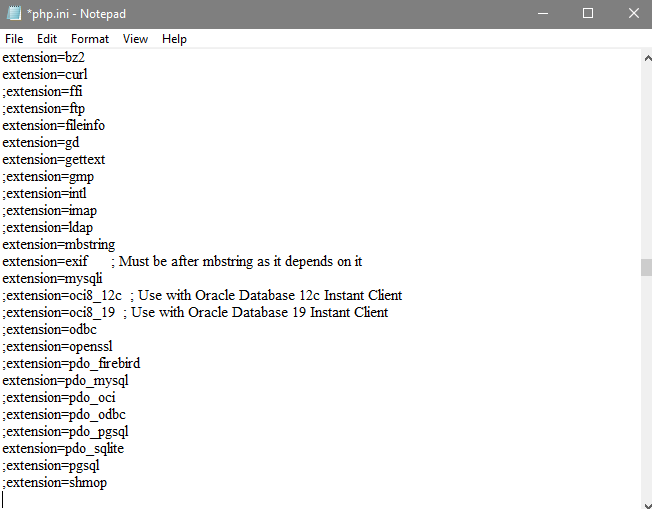

| Nama  | Oktovan Agung Shailendra|
|-------|-------------------------|
|NIM    |: 312010131              |
|Kelas  |: TI.20.A.1              |

---

# Praktikum 11 PHP Framework (Codeigniter)

# Langkah - Langkah Praktikum

## Buat folder baru dengan nama **lab11_php_ci** pada docroot webserver (**htdocs**)

## Persiapan 
Sebelum memulai menggunakan Framework Codeigniter, perlu dilakukan konfigurasi pada web server. Beberapa ekstensi PHP perlu diaktifkan untuk kebutuhan pengembangan Codeigniter 4.

Berikut beberapa ekstensi yang perlu diaktifkan :
- **php-json** ekstensi untuk bekerja dengan JSON;
- **php-mysqlnd** native drive untuk MySQL;
- **php-xml** ekstensi untuk bekerja dengan XML;
- **php-intl** ekstensi untuk membuat aplikasi multibahasa;
- **libcurl** (opsional), jika ingin pakai Curl.

Untuk mengaktifkan ekstensi tersebut, melalui **XAMPP Control Panel**, pada bagian Apache klik **Config** > **PHP.ini**

Pada bagian extension, hilangkan tanda **;** (titik koma) pada ekstesi yang akan diaktikan. Kemudian simpan kemali filenya dan restart Apache webserver.

## Instalasi Codeigniter 4
Untuk melakukak instalasi Codigniter 4 dapat dilakukan dengan dua cara, yaitu cara manual dan menggunakan *composer*. Pada praktikum ini saya menggunakan cara manual.

- Unduk **Codeigniter** dari website `https://codeigniter.com/download`
- ekstrak file zip Codeigniter ke direktori **htdocs/lab11_php_ci**.
- Ubah nama direktori **framework-4x.xx** menjadi **ci4**.
- Buka browser dengan alamat `http://localhost/lab11_ci/ci4/public/`
