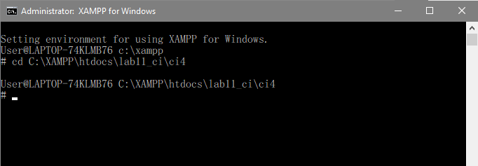
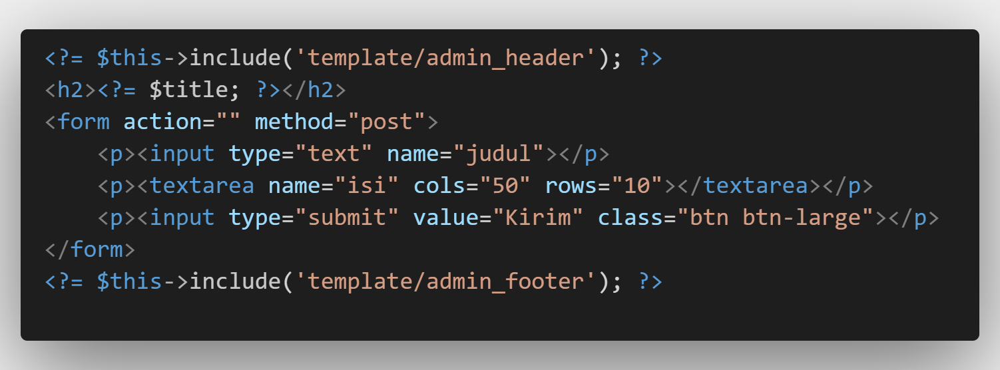
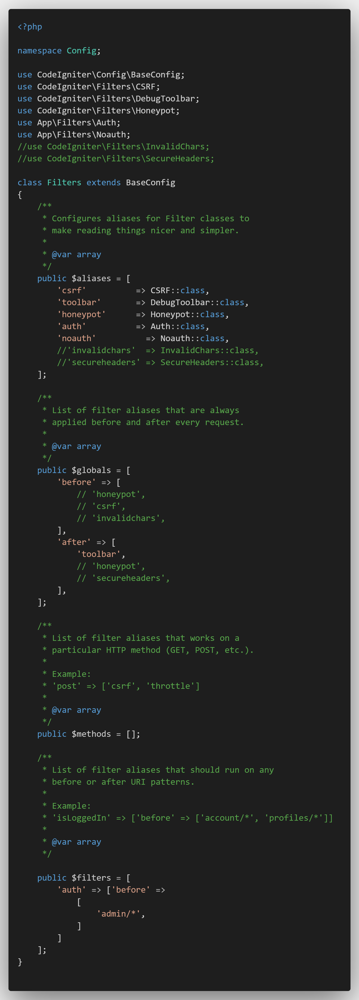
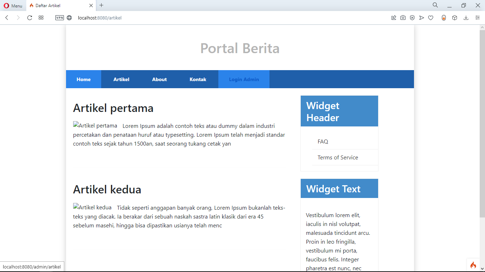

| Nama  | Oktovan Agung Shailendra|
|-------|-------------------------|
|NIM    |: 312010131              |
|Kelas  |: TI.20.A.1              |

---
Daftar Isi :
- [Praktikum 11 PHP Framework (Codeigniter)](#praktikum-11-php-framework-codeigniter)
- [Praktikum 12 Framework Lanjutan (CRUD)](#praktikum-12-framework-lanjutan-crud)
- [Praktikum 13 Framework Lanjutan (Modul Login)](#praktikum-13-framework-lanjutan-modul-login)
- [Praktikum 14 Pagination & Pencarian](#praktikum-14-pagination--pencarian)
---

# Praktikum 11 PHP Framework (Codeigniter)

## Langkah - Langkah Praktikum :

## Buat folder baru dengan nama **lab11_ci** pada docroot webserver (**htdocs**)

## Persiapan 
Sebelum memulai menggunakan Framework Codeigniter, perlu dilakukan konfigurasi pada web server. Beberapa ekstensi PHP perlu diaktifkan untuk kebutuhan pengembangan Codeigniter 4.

Berikut beberapa ekstensi yang perlu diaktifkan :
- **php-json** ekstensi untuk bekerja dengan JSON;
- **php-mysqlnd** native drive untuk MySQL;
- **php-xml** ekstensi untuk bekerja dengan XML;
- **php-intl** ekstensi untuk membuat aplikasi multibahasa;
- **libcurl** (opsional), jika ingin pakai Curl.

Untuk mengaktifkan ekstensi tersebut, melalui **XAMPP Control Panel**, pada bagian Apache klik **Config** > **PHP.ini**


Pada bagian extension, hilangkan tanda **;** (titik koma) pada ekstesi yang akan diaktikan. Kemudian simpan kemali filenya dan restart Apache webserver.


## Instalasi Codeigniter 4
Untuk melakukak instalasi Codigniter 4 dapat dilakukan dengan dua cara, yaitu cara manual dan menggunakan *composer*. Pada praktikum ini saya menggunakan cara manual.

- Unduk **Codeigniter** dari website `https://codeigniter.com/download`
- ekstrak file zip Codeigniter ke direktori **htdocs/lab11_ci**.
- Ubah nama direktori **framework-4x.xx** menjadi **ci4**.
- Buka browser dengan alamat `http://localhost/lab11_ci/ci4/public/`


## Menjalankan CLI (*Command Libe INterface*)
Codeigniter 4 menyediakan CLI untuk mempermudah proses development. Untuk mengakses CLI buka terminal / command promt.
Arahkan lokasi direktori sesuai dengan direktorikerja project yang dibuat (**xampp/htdocs/lab11_ci/ci4/**)



Perintah yang dapat dijalankan untuk memanggil CLI Codeigniter adalah `php spark`


## Mengaktifkan Mode Debugging
Untuk mengaktifkan Mode Debugging bisa dengan mengetikan perintah ` php spark serve`


Untuk mengetahui pesan error apabila terjadi kesalahan dalam membuat kode program caranya degan mengubah kode filde pada **app/Controllers/home.php**, hapus tanda ; (titik koma) nya.


Dan untuk melihat hasilnya ketik `https://localhost:8080` pada web browser.


Kemudian ubah nama file **env** menjadi **.env**, kemudian buka file tersebut, dan hapus tanda **#** pada **CI_ENVIRONMENT =**, dan ubah variavle menjadi **development**


Dan refresh url sebelumnya untuk melihat perubahan.


## Struktur Direktori


## Routing & Controller
Router terletak pada **app/config/Routes.php**

## Membuat Route Baru
Tabahkan kode berikut pada **Routes.php**
```php
$routes->get('/about', 'Page::about');
$routes->get('/contact', 'Page::contact');
$routes->get('/faqs', 'Page::faqs');
```


Untuk mengetahui apakah route yang ditambahkan sudah benar, buka CLI dan jalankan perintah berikut `php spark routes`


Selanjutnya coba akses route yang telah dibuat dengan mengakses alamat `http://localhost:8080/about`


## Membuat Controller
Selanjutnya adalah membuat Controller Page. Buat file baru dengan nama **page.php** pada direktori Controller kemudian isi dengan kode berikut

Kemudian simpan.
Selanjutnya refresh kembali halaman web browser, maka akanmenampilkan hasil seperti berikut.


Auto Routing Secara default fitur autoroute pada Codeiginiter sudah aktif. Untuk mengubah status autoroute dapat mengubah nilai variabelnya. Untuk menonaktifkan ubah nilai **true** menjadi **false**.
`$routes->setAutoRoute(true);`


Tambahkan methode baru pada Controller Page seperti berikut


Methode ini belum ada pada routing, sehingga cara mengaksesnya dengan menggunakan url berikut `http://localhost:8080/page/tos`


## Membuat View
Selanjutnya adalah membuat view untuk tampilan web agar lebih menarik. Buat file baru dengan nama **about.php** pada direktori view (**app/view/**) kemudian masukan kode berikut.


Ubah **methode about** pada **Controller Page** menjadi seperti berikut.


Kemudian refresh halaman tersebut untuk melihat hasilnya.


## Membuat Layout Web Dengan CSS
Buat file css direktori **public** dengan nama **style.css** saya akan gunakan layout yang pernah dibuat pada praktikum 4 (copy file dari praktikum lab4_layout).


Kemudian buat folder template pada direktori view kemudian buat file **header.php** & **footer.php** pada folder tersebut.

- header.php


- footer.php


Kemudian ubah file **about.php** seperti berikut


Selanjutnya refresh halaman `http://localhost:8080/about`


# Pertanyaan & Tugas

## Lengkapi kode program untuk menu lainnya yang ada pada Controller Page, sehingga semua link pada navigasi header dapat menampilkan tampilan dengan layout yang sama.

# Jawaban

- Ubah isi pada **Routes.php** menjadi seperti berikut.


- Ubah isi pada **page.php** menjadi seperti berikut


- Pada folder views buat ile baru dengan nama ; **home.php**, **about.php**, **artikel.php**, **contact.php**, **faqs.php**, dan **tos.php**. Pada masing - masing file tersebut masukan kode berikut


- Untuk melihat hasilnya bisa dengan mengakses alamat berikut `http://localhost:8080/contact`


---
---

# Praktikum 12 Framework Lanjutan (CRUD)

## Langkah - Langkah Praktikum :

## Persiapan
Untuk Memulai membuat aplikasi CRUD sederhana, yang perlu disiapkan adalah database server menggunakan MySQL. Pastikan MySQL Server sudah dapat dijalankan melalui XAMPP Control Panel.

## Membuat Database 
```
CREATE DATABASE lab_ci4;
```

## Membuat Tabel
```
CREATE TABLE artikel (
  id INT(11) auto_increment,
  judul VARCHAR(200) NOT NULL,
  isi TEXT,
  gambar VARCHAR(200),
  status TINYINT(1) DEFAULT 0,
  slug VARCHAR(200),
  PRIMARY KEY(id)
);
```

## Konfigurasi Koneksi Database
Selanjutnya membuat konfigurasi untuk menghubungkan dengan database server. Konfigurasi dapat dilakukan dengan dua acara, yaitu pada file **app/config/database.php** atau menggunakan file **.env**. Pada praktikum ini kita gunakan konfigurasi pada file **.env**.


## Membuat Model
Selanjutnya adalah membuat Model untuk memproses data Artikel. Buat file baru pada direktori **app/Models** dengan nama **ArtikelModel.php**.


## Membuat Controller
Buat Controllers baru dengan nama **Artikel.php** pada direktori **app/Controllers**.


## Membuat View
Buat direktori baru dengan nama **artikel** pada direktori **app/view**, kemudian buat file baru dengan nama **index.php**.


Selanjutnya buka browser kembali, dengan mengakses url `http://localhost:8080/artikel`


belum ada data yang ditampilkan. Kemudian coba tambahkan beberapa data pada database agar dapat ditampilkan dataya.
```
INSERT INTO artikel (judul, isi, slug) VALUE 
('Artikel pertama', 'Lorem Ipsum adalah contoh teks atau dummy dalam industri percetakan dan penataan huruf atau typesetting. Lorem Ipsum telah menjadi standar contoh teks sejak tahun 1500an, saat seorang tukang cetak yang tidak dikenal mengambil sebuah kumpulan teks dan mengacaknya untuk menjadi sebuah buku contoh huruf.', 'artikel-pertama'),
('Artikel kedua', 'Tidak seperti anggapan banyak orang, Lorem Ipsum bukanlah teks-teks yang diacak. Ia berakar dari sebuah naskah sastra latin klasik dari era 45 sebelum masehi, hingga bisa dipastikan usianya telah mencapai lebih dari 2000 tahun.', 'artikel-kedua');
 ```

Refresh kembali browser, sehingga akan ditampilkan hasilnya.


## Membuat Tampilan Detail Artikel
Tampilan pada saat judul berita di klik maka akan diarahkan ke halaman yang berbeda. Tambahkan fungsi baru pada **Controller Artikel** dengan nama **view()**.


## Membuat View Detail
Buat view baru untuk halaman detail dengan nama **app/view/artikel/detail.php**


## Membuat Routing Untuk Artikel Detail
Buka kembali file **app/config/Routes.php**, kemudian tambahkan routing untuk artikel detail.


Untuk melihat hasilnya bisa dengan mengklik salah satu artikelnya.


## Membuat Menu Admin
Menu admin adalah untuk proses CRUD data artikel. Buat method baru pada **Controller/Artikel** dengan nama **admin_index()**.


Selanjutnya buat view untuk tampilan admin pada **Views/artikel** dengan nama **admin_index.php**


Tambahkan routing untuk menu admin seperti berikut :


Untuk mengakses menu admin bisa dengan menggunakan url `http://localhost:8080/admin/artikel`


## Menambahkan Data Artikel
Tambahkan fungsi/methode baru pada **Controller/Artikel** dengan nama **add()**.


Kemudian buat view untuk form tambahan dengan nama **form_add.php**.



Untuk mengakses menu add bisa dengan menggunakan url `http://localhost:8080/admin/artikel/add`


## Mengubah Data
Tambahkan fungsi/methode baru pada **Controller/Admin** dengan nama **edit()**.


Untuk mengakses menu add bisa dengan menggunakan url `http://localhost:8080/admin/artikel/edit/...(nama artikel yang ingin di edit)`


Tampilan Setelah Di Edit.


## Menghapus Data
Tambahkan fungsi/methode baru pada **Controller/Artikel** dengan nama **delet()**.


Untuk menghapus suatu artikel dapat melalui menu artikel kemudain pilih artikel yang ingin di hapus dengan mengklik tombol **Hapus**.


Tampilan Setelah Di Hapus.


---
---

# Praktikum 13 Framework Lanjutan (Modul Login)

## Langkah - Langkah Praktikum

## Persiapan
Untuk mmemulai membuat Modul Login, yang perlu disiapkan adalah database serber menggunakan MySQL. Pastikan MySQL Server sudah dapat dijalankan melalui XAMPP

## Membuat Tabel user Login
```
CREATE TABLE user (
  id INT(11) auto_increment,
  username VARCHAR(200) NOT NULL,
  useremail VARCHAR(200),
  userpassword VARCHAR(200),
  PRIMARY KEY(id) 
);
```

## Membuat Model User
Selanjutnya membuat Model untuk memproses data Login. Buat file baru pada direktori **app/Models** dengan nama **UserModel.php**


## Membuat COntroller User
Membuat Controller baru dengan nama **User.php** pada direktori **app/Controllers**. Kemudian tambahkan methode **index()** untuk menampilkan daftar user, dan methode **login()** untuk proses login.


## Membuat View Login
Buat direktri baru dengan nama **user** pada direktori **app/views**, kemudian buat file baru dengan nama **login.php**


## Membuat Database Seeder
Database seeder digunakan untuk membuat data dummy. Untuk keperluan ujicoba modul login, kita perlu memasukan data user dan password kedalam database. Untuk itu buat database seeder untuk tabel user. Buka CLI, kemudain tulis perintah berikut :

```
php spark make:seeder UserSeeder
```

Selanjutnya, buka file **UserSeeder.php** yang berada di lokasi direktori **/app/Database/Seeds/UserSeeder.php** kemudian isi dengan kode berikut :


Selanjutnya buka kembali CLI dan ketik peritah berikut
```
php spark db:seed UserSeeder
```

Kemudian buka kembali file `.env` kemudian hapus tanda pagar `#` pada bagian `app.session....`


## Menambahkan Auth Filter
Selanjutnya membuat filter untuk halaman admin, buat file baru dengan nama **Auth.php** pada direktori **app/Filters**


Kemudian buka file **app/Config/Filters/php** dan ubah seperti berikut :



## Percobaan Akses Menu Admin
Buka url dengan alamat `http://localhost:8080/admin/artikel` ketika alamat admin diakses maka, akan dialihkan ke halaman login terlebih dahulu. Atau bisa juga melalui tombol login pada bagian menu pada artikel.

- Melalui alamat admin.


- Melalui tombol login admin.


Untuk login bisa dengan memasukan :
Email : admin@email.com
Password : admin123

Setelah masuk maka akan langsung di arahkan ke halaman admin 


## Menambahkan Fungsi Logout
Tambahkan methode logout pada **Controllers/User** seperti berikut :


Untuk logout bisa langsung mengklik tombol logout pada menu admin.


---
---

# Praktikum 14 Pagination & Pencarian

# Langkah - Langkah Praktikum

## Membuat Pagination
Pagination merupakan proses yang digunakan untuk membatasi tampilan yang panjang dari data yang banyak pada sebuah website. Fungsi pagination adalah memecah tampilan menjadi beberapa halaman tergantung banyaknya data yang akan ditampilkan pada setiap halaman.

Pada CodeIgniter 4 fungsi pagination sudah tersedia pada Library sehingga cukup mudah menggunakannya

Untuk membuka pagination, buka kembali **Controller/Artikel**, kemudian modifikasi kode pada methode **admin_index** seperti berikut.


Kemudian buka file **views/artikel/admin_index.php** dan tambahkan kode berikut dibawah deklarasi tabel data.


Selanjutnya buka kembali menu daftar artikel, tambahkan data lagi untuk melihat hasilnya.


## Membuat Pencarian
Pencarian data digunakan untuk memfilter data
Untuk membuat pencarian data, buka kembali **Cotroller/Artikel**, pada method **admin_index** ubah kodenya seperti beriku.


Kemudian buka kembali file **views/artikel/admin_index.php** dan tambahkan form pencarian sebelum deklarasi tabel seperti berikut :


Dan pada link pager ubah seperti berikut.


Selanjutnya uji coba dengan membuka kembali halaman admin artikel, masukkan kata kunci tertentu pada form pencarian.


