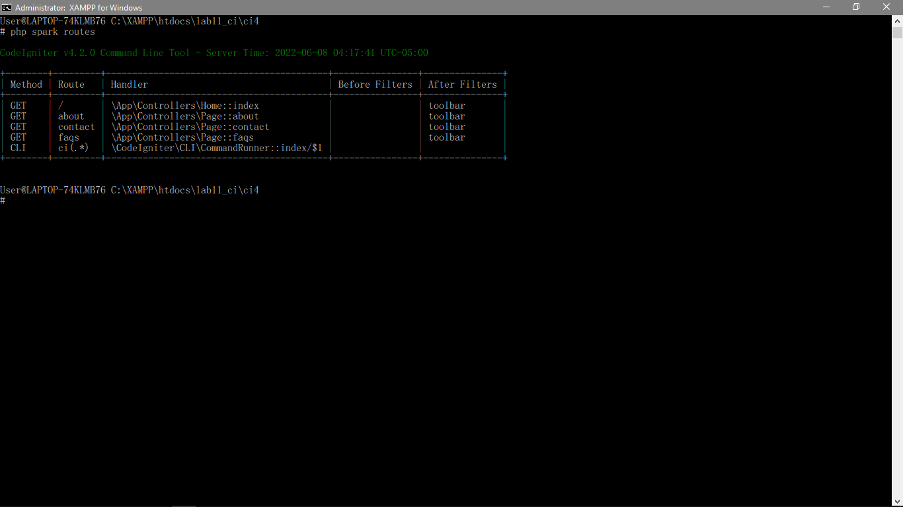

| Nama  | Oktovan Agung Shailendra|
|-------|-------------------------|
|NIM    |: 312010131              |
|Kelas  |: TI.20.A.1              |

---

# Praktikum 11 PHP Framework (Codeigniter)

# Langkah - Langkah Praktikum

## Buat folder baru dengan nama **lab11_ci** pada docroot webserver (**htdocs**)

## Persiapan 
Sebelum memulai menggunakan Framework Codeigniter, perlu dilakukan konfigurasi pada web server. Beberapa ekstensi PHP perlu diaktifkan untuk kebutuhan pengembangan Codeigniter 4.

Berikut beberapa ekstensi yang perlu diaktifkan :
- **php-json** ekstensi untuk bekerja dengan JSON;
- **php-mysqlnd** native drive untuk MySQL;
- **php-xml** ekstensi untuk bekerja dengan XML;
- **php-intl** ekstensi untuk membuat aplikasi multibahasa;
- **libcurl** (opsional), jika ingin pakai Curl.

Untuk mengaktifkan ekstensi tersebut, melalui **XAMPP Control Panel**, pada bagian Apache klik **Config** > **PHP.ini**


Pada bagian extension, hilangkan tanda **;** (titik koma) pada ekstesi yang akan diaktikan. Kemudian simpan kemali filenya dan restart Apache webserver.


## Instalasi Codeigniter 4
Untuk melakukak instalasi Codigniter 4 dapat dilakukan dengan dua cara, yaitu cara manual dan menggunakan *composer*. Pada praktikum ini saya menggunakan cara manual.

- Unduk **Codeigniter** dari website `https://codeigniter.com/download`
- ekstrak file zip Codeigniter ke direktori **htdocs/lab11_ci**.
- Ubah nama direktori **framework-4x.xx** menjadi **ci4**.
- Buka browser dengan alamat `http://localhost/lab11_ci/ci4/public/`


## Menjalankan CLI (*Command Libe INterface*)
Codeigniter 4 menyediakan CLI untuk mempermudah proses development. Untuk mengakses CLI buka terminal / command promt.
Arahkan lokasi direktori sesuai dengan direktorikerja project yang dibuat (**xampp/htdocs/lab11_ci/ci4/**)


Perintah yang dapat dijalankan untuk memanggil CLI Codeigniter adalah `php spark`


## Mengaktifkan Mode Debugging
Untuk mengaktifkan Mode Debugging bisa dengan mengetikan perintah ` php spark serve`


Untuk mengetahui pesan error apabila terjadi kesalahan dalam membuat kode program caranya degan mengubah kode filde pada **app/Controllers/home.php**, hapus tanda ; (titik koma) nya.


Dan untuk melihat hasilnya ketik `https://localhost:8080` pada web browser.


Kemudian ubah nama file **env** menjadi **.env**, kemudian buka file tersebut, dan hapus tanda **#** pada **CI_ENVIRONMENT =**, dan ubah variavle menjadi **development**


Dan refresh url sebelumnya untuk melihat perubahan.


## Struktur Direktori


## Routing & Controller
Router terletak pada **app/config/Routes.php**

## Membuat Route Baru
Tabahkan kode berikut pada **Routes.php**
```php
$routes->get('/about', 'Page::about');
$routes->get('/contact', 'Page::contact');
$routes->get('/faqs', 'Page::faqs');
```


Untuk mengetahui apakah route yang ditambahkan sudah benar, buka CLI dan jalankan perintah berikut `php spark routes`



Selanjutnya coba akses route yang telah dibuat dengan mengakses alamat `http://localhost:8080/about`


## Membuat Controller
Selanjutnya adalah membuat Controller Page. Buat file baru dengan nama **page.php** pada direktori Controller kemudian isi dengan kode berikut

Kemudian simpan.
Selanjutnya refresh kembali halaman web browser, maka akanmenampilkan hasil seperti berikut.


Auto Routing Secara default fitur autoroute pada Codeiginiter sudah aktif. Untuk mengubah status autoroute dapat mengubah nilai variabelnya. Untuk menonaktifkan ubah nilai **true** menjadi **false**.
`$routes->setAutoRoute(true);`


Tambahkan methode baru pada Controller Page seperti berikut
